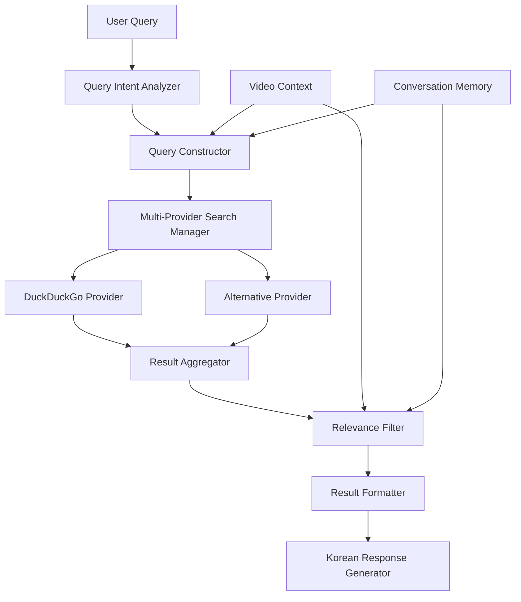

# Design Document

## Overview

The improved web search system will replace the current basic DuckDuckGo search with an intelligent, context-aware search agent that provides highly relevant results. The system will use multiple search providers, intelligent query construction, relevance filtering, and enhanced result presentation to deliver a superior user experience.

## Architecture



## Components and Interfaces

### QueryIntentAnalyzer
- **Purpose**: Analyzes user input to determine search intent and extract key terms
- **Methods**:
  - `analyze_intent(query: str, video_context: dict) -> SearchIntent`
  - `extract_search_terms(query: str) -> List[str]`
  - `determine_search_type(query: str) -> SearchType` (news, background, general)

### QueryConstructor
- **Purpose**: Builds optimized search queries using video context and user intent
- **Methods**:
  - `construct_query(intent: SearchIntent, video_context: dict, memory: dict) -> str`
  - `enhance_with_context(base_query: str, context: dict) -> str`
  - `generate_fallback_queries(primary_query: str) -> List[str]`

### MultiProviderSearchManager
- **Purpose**: Manages multiple search providers with fallback capabilities
- **Methods**:
  - `search(query: str, providers: List[str]) -> List[SearchResult]`
  - `get_available_providers() -> List[SearchProvider]`
  - `handle_provider_failure(provider: str, error: Exception) -> None`

### RelevanceFilter
- **Purpose**: Scores and filters search results based on video content relevance
- **Methods**:
  - `score_relevance(result: SearchResult, video_context: dict) -> float`
  - `filter_results(results: List[SearchResult], threshold: float) -> List[SearchResult]`
  - `rank_by_relevance(results: List[SearchResult]) -> List[SearchResult]`

### ResultFormatter
- **Purpose**: Formats search results for optimal presentation
- **Methods**:
  - `format_results(results: List[SearchResult]) -> str`
  - `create_summary(result: SearchResult) -> str`
  - `format_korean_response(results: List[SearchResult]) -> str`

## Data Models

### SearchIntent
```python
@dataclass
class SearchIntent:
    intent_type: SearchType  # NEWS, BACKGROUND, GENERAL
    search_terms: List[str]
    confidence: float
    requires_context: bool
    language_preference: str
```

### SearchResult
```python
@dataclass
class SearchResult:
    title: str
    url: str
    snippet: str
    source: str
    relevance_score: float
    publish_date: Optional[datetime]
    language: str
```

### SearchProvider
```python
class SearchProvider(ABC):
    @abstractmethod
    def search(self, query: str, limit: int = 10) -> List[SearchResult]:
        pass
    
    @abstractmethod
    def is_available(self) -> bool:
        pass
```

## Correctness Properties

*A property is a characteristic or behavior that should hold true across all valid executions of a system-essentially, a formal statement about what the system should do. Properties serve as the bridge between human-readable specifications and machine-verifiable correctness guarantees.*

Property 1: Context-enhanced query construction
*For any* user search request and video context, the constructed search query should contain relevant elements from the video context (title, speaker, event information)
**Validates: Requirements 1.1, 1.2**

Property 2: Relevance filtering consistency
*For any* set of search results and video context, all returned results should have relevance scores above the minimum threshold
**Validates: Requirements 1.3**

Property 3: Korean formatting with attribution
*For any* search result display, the output should contain Korean text and clear source attribution information
**Validates: Requirements 1.4**

Property 4: Intent-based query enhancement
*For any* vague search request, the enhanced query should incorporate video context to clarify the search intent
**Validates: Requirements 2.1**

Property 5: User intent preservation
*For any* specific search terms provided by the user, those terms should remain present in the enhanced query
**Validates: Requirements 2.4**

Property 6: Universal relevance scoring
*For any* search result, the system should assign a relevance score based on similarity to video content
**Validates: Requirements 3.1**

Property 7: Entity-based result prioritization
*For any* set of search results, those containing video-specific entities (speakers, companies, events) should be ranked higher than those without
**Validates: Requirements 3.2**

Property 8: Multi-provider result aggregation
*For any* search query with multiple available providers, the final results should include results from all functioning providers
**Validates: Requirements 3.3**

Property 9: Relevance and recency ranking
*For any* set of search results, they should be ordered by relevance score and recency (newer results ranked higher for equal relevance)
**Validates: Requirements 3.4**

Property 10: Provider fallback behavior
*For any* search request where the primary provider fails, the system should automatically attempt alternative providers
**Validates: Requirements 4.2**

Property 11: Network error handling
*For any* network connectivity issue, the system should provide appropriate error messages with retry options
**Validates: Requirements 4.3**

Property 12: Cache consistency
*For any* identical search query made within the cache timeout period, the system should return cached results
**Validates: Requirements 4.4**

Property 13: Result formatting completeness
*For any* search result display, each result should contain title, summary, and source URL information
**Validates: Requirements 5.1**

Property 14: Korean content preservation
*For any* search result containing Korean content, the original formatting and language should be preserved in the output
**Validates: Requirements 5.2**

Property 15: Foreign language summarization
*For any* search result in a foreign language, the system should provide a brief Korean summary
**Validates: Requirements 5.3**

Property 16: List formatting for multiple results
*For any* response containing multiple search results, they should be presented in a numbered or bulleted list format
**Validates: Requirements 5.4**

Property 17: Timestamp highlighting
*For any* search results containing timestamps or dates, recent information should be visually highlighted
**Validates: Requirements 5.5**

<function_calls>
<invoke name="prework">
<parameter name="featureName">improved-web-search

## Error Handling

### Search Provider Failures
- **Primary Provider Down**: Automatically fallback to secondary providers (Google Custom Search, Bing)
- **All Providers Down**: Graceful degradation with suggestion to use video-only features
- **Rate Limiting**: Implement exponential backoff and provider rotation
- **Invalid Responses**: Validate response format and handle malformed data

### Network Issues
- **Timeout Handling**: 10-second timeout with retry mechanism
- **Connection Errors**: Clear error messages with retry options
- **Partial Failures**: Return partial results when some providers succeed

### Query Processing Errors
- **Intent Analysis Failure**: Fallback to basic keyword search
- **Context Extraction Errors**: Use available context or proceed without enhancement
- **Relevance Scoring Errors**: Return unscored results with warning

## Testing Strategy

### Unit Testing
- Test individual components (QueryConstructor, RelevanceFilter, etc.)
- Mock external search providers for consistent testing
- Test error handling scenarios with simulated failures
- Validate data model serialization/deserialization

### Property-Based Testing
- Use Hypothesis library for Python property-based testing
- Generate random video contexts, search queries, and result sets
- Test properties across wide range of inputs (minimum 100 iterations per property)
- Each property test will be tagged with format: **Feature: improved-web-search, Property {number}: {property_text}**

### Integration Testing
- Test complete search workflow with real providers
- Validate Korean language handling and formatting
- Test caching behavior and cache invalidation
- Verify fallback mechanisms with provider simulation

### Performance Testing
- Measure search response times under various conditions
- Test concurrent search requests
- Validate memory usage with large result sets
- Monitor provider response times and reliability